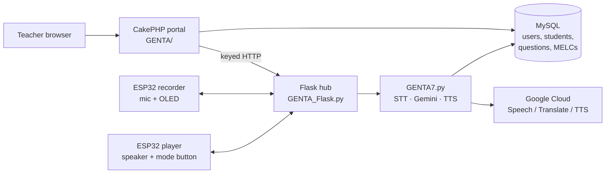

# GENTA

<p align="center">
  
</p>

<p align="center">
  
  
  
  
</p>

**AI-powered classroom companion for DepEd Grade 3 — web portal, on-device voice AI, and ESP32 hardware in one system.**

GENTA lets a teacher manage students, MELCs, and quizzes in a browser, while a physical robot in the classroom talks with a learner: it records answers, scores them against the teacher’s item bank, then writes a Gemini-backed analysis and a tailored module the web app can fetch.

This repository is the **thesis system** as a single, GitHub-safe monorepo: the CakePHP web app, the Python/Flask IoT brain, and the ESP32 firmware. Runtime junk (venvs, `vendor/`, ffmpeg, speech models, wav dumps, student uploads) is excluded so the source can actually be published.

| Layer | Folder | What it is |
| --- | --- | --- |
| **Web** | [`GENTA/`](GENTA/) | Teacher portal — CakePHP 4.6, MySQL, auth, quizzes, MELCs, report pull from IoT |
| **IoT** | [`GENTA_MAIN_SYSTEM_IoT/`](GENTA_MAIN_SYSTEM_IoT/) | Flask device hub + `GENTA7.py` voice/quiz/AI engine |
| **Firmware** | [`GENTA_MAIN_SYSTEM_IoT/ARDUINO/`](GENTA_MAIN_SYSTEM_IoT/ARDUINO/) | ESP32 recorder (INMP441 + OLED) and player (I2S speaker) |

---

## Why this project

Classroom assessment is usually paper-in, spreadsheet-out. GENTA closes that loop:

1. Teacher authors items and maps them to **MELCs** (Most Essential Learning Competencies).
2. Student identifies themselves to the robot with an LRN.
3. The robot **assists** (conversation) or **quizzes** (spoken answers vs. the bank).
4. Gemini produces an **analysis report** and a **tailored module**.
5. The CakePHP portal pulls those files through a keyed Flask API.

That split is intentional: the web app is the system of record; the IoT stack is the real-time edge.

---

## Architecture



**Web (`GENTA/`)**  
CakePHP 4.6 teacher dashboard: register/verify email, login with rate-limit + math CAPTCHA + lockout, CRUD students and questions, quiz versions, MELC alignment, Shepherd.js walkthrough, SMTP password reset. Prefix: `/teacher/*`.

**IoT (`GENTA_MAIN_SYSTEM_IoT/`)**  
- `GENTA_Flask.py` — admin login, UDP ESP32 discovery, recording wait/notify, OLED commands, Wi‑Fi provisioning proxy, backups, teacher-approval callbacks, report download endpoints.  
- `GENTA7.py` — LRN lookup, assisting mode, `QUIZZER()`, Gemini analysis + tailored DOCX, Google Cloud STT/TTS.  
- `config.py` — env-driven settings (no secrets in git).

**Firmware (`ARDUINO/`)**  
Two ESP32s. Credentials live in NVS (`Preferences`), not in source.

| Sketch | Role | I/O |
| --- | --- | --- |
| `GENTA/GENTA.ino` | Recorder | INMP441 I2S mic, SH1106 OLED eyes, HTTP upload |
| `GENTA2/GENTA2.ino` | Player | I2S speaker, GPIO 22 assist/quiz toggle |
| `GENTA_Recorder/` / `GENTA_Player/` | Alternate sketches | Same split, SPIFFS/LittleFS data |

---

## Tech stack

| Area | Choices |
| --- | --- |
| Web | PHP 8.3, CakePHP 4.6, Authentication + Authorization plugins, MySQL/MariaDB, SMTP |
| IoT | Python 3.11+, Flask, Flask-CORS, mysql-connector, pygame, pydub |
| AI | Google Gemini (`google.generativeai`), Cloud Speech-to-Text, Translate, Neural2 TTS |
| Hardware | ESP32, INMP441, I2S DAC/amp, 128×64 OLED (U8g2) |
| Tests | PHPUnit (`GENTA/tests`), Playwright smoke scripts |

---

## Repository layout

```
GENTA_SYSTEM/
├── GENTA/                          # WEB — CakePHP teacher portal
│   ├── src/Controller/             # Users, Teacher dashboard, MELCs, security
│   ├── src/Model/                  # Students, questions, quizzes, MELCs
│   ├── templates/                  # Login, dashboard, quiz authoring
│   ├── config/schema/              # SQL migrations (no student dumps)
│   ├── tests/                      # PHPUnit + smoke
│   └── webroot/                    # CSS/JS, Shepherd, mascot assets
├── GENTA_MAIN_SYSTEM_IoT/          # IOT — Flask + AI engine + firmware
│   ├── GENTA_Flask.py
│   ├── GENTA7.py
│   ├── config.py / config.example.py
│   ├── templates/                  # Admin UI (login, upload, Wi‑Fi)
│   ├── ARDUINO/                    # ESP32 sketches
│   └── requirements.txt
├── .env.example
└── README.md
```

**Not in git (on purpose):** `vendor/`, `node_modules/`, Python venvs, ffmpeg builds, Vosk/Kaldi `model/`, ESP32 `.bin` artifacts, wav/mp3 output, student uploads, Google service-account JSON, nested `.git` history.

---

## Quick start

### 1. Web portal

```bash
cd GENTA
cp .env.example .env          # fill SECURITY_SALT, DATABASE_URL, SMTP
composer install
cp config/app_local.example.php config/app_local.php
# Import schema
mysql -u genta -p genta < config/schema/init_scalingo.sql
bin/cake server -p 8765
```

Open [http://localhost:8765](http://localhost:8765) → `/users/login`.

PHPUnit:

```bash
cd GENTA
composer test
```

### 2. IoT / Flask hub

```bash
cd GENTA_MAIN_SYSTEM_IoT
python -m venv .venv
# Windows: .venv\Scripts\activate
pip install -r requirements.txt
copy .env.example .env        # GENAI_API_KEY, MySQL, ADMIN_PASSWORD_HASH
# Place Google Cloud service account JSON at GoogleCloud/key.json (gitignored)
python GENTA_Flask.py         # typically :5000
```

In another terminal:

```bash
python GENTA7.py
```

`ffmpeg` must be on `PATH` (or set `FFMPEG_PATH`). Do **not** commit the full ffmpeg zip — it is ~200 MB per binary.

Admin password hash (SHA-256 hex of your password):

```bash
python -c "import hashlib; print(hashlib.sha256(b'your-password').hexdigest())"
```

### 3. Firmware

Arduino IDE or `arduino-cli`, board **ESP32 Dev Module**. Install ESP32 core + U8g2. Flash `ARDUINO/GENTA` (recorder) and `ARDUINO/GENTA2` (player). First boot: set Wi‑Fi through the Flask **Wi‑Fi management** page (NVS), not hardcoded SSID/password.

Hardware notes live in [`GENTA_MAIN_SYSTEM_IoT/ARDUINO/README.md`](GENTA_MAIN_SYSTEM_IoT/ARDUINO/README.md).

---

## Environment variables

See [`.env.example`](.env.example) and [`GENTA_MAIN_SYSTEM_IoT/.env.example`](GENTA_MAIN_SYSTEM_IoT/.env.example).

| Variable | Used by | Purpose |
| --- | --- | --- |
| `SECURITY_SALT` | Web | CakePHP security salt |
| `DATABASE_URL` / `MYSQL_*` | Both | Shared student/question database |
| `SMTP_*` | Web | Password reset / verification mail |
| `NGROK_BASE_URL` | Web | Flask base URL for analysis/module fetch |
| `NGROK_API_KEY` / `GENTA_REPORT_UPLOAD_API_KEY` | Both | Shared report API key |
| `GENAI_API_KEY` | IoT | Gemini |
| `GOOGLE_APPLICATION_CREDENTIALS` | IoT | Path to Cloud STT/TTS service account |
| `ADMIN_PASSWORD_HASH` | IoT | Flask admin (SHA-256 hex) |
| `ESP_BASE` / `ESP_SPEAKER` | IoT | Fallback ESP32 IPs if UDP discovery misses |

---

## Data model (web)

Core tables (see `GENTA/config/schema/`):

- `users` — teachers, email verification, reset tokens, lockout counters  
- `students` — name, LRN/`student_code`, grade, section, remarks (fed to the robot)  
- `subjects`, `questions`, `quiz_versions`  
- `student_quiz` / `student_quiz_questions` — attempts  
- `melcs` — competency alignment per teacher  

Password history and progressive lockout are documented in `GENTA/SECURITY_IMPLEMENTATION.md`.

---

## Security notes (this repo)

Secrets that previously lived in source (DB passwords, Gemini keys, Gmail app passwords, Wi‑Fi PSK, Cloud service-account JSON) were **removed** before this monorepo was published. Local copies of `config/app_local.php`, `.env`, and `GoogleCloud/key.json` stay on your machine and are gitignored.

Do not commit:

- Student uploads or `config/schema/genta.sql` dumps (PII)
- `vendor/` / `newenv/` / ffmpeg / `model/` (GitHub 100 MB file cap; this tree was ~2.3 GB before ignore rules)

If a credential ever lived in git history of the older split remotes (`JT-028/GENTA`, `JT-028/GENTA_MAIN_SYSTEM_IoT`), **rotate it**.

---

## Tests

| Suite | Command |
| --- | --- |
| PHP unit | `cd GENTA && composer test` |
| PHP CS | `cd GENTA && composer cs-check` |
| IoT syntax | `python -m py_compile GENTA_MAIN_SYSTEM_IoT/GENTA_Flask.py GENTA_MAIN_SYSTEM_IoT/config.py` |

GitHub Actions CI is disabled for this portfolio archive (no hosted runner / billing required).

---

## Thesis / portfolio

Built as a 2026 undergraduate thesis: full-stack PHP, embedded C++ on ESP32, a Python voice pipeline, and Google Cloud AI — one classroom product instead of three disconnected demos.

Author: **Jonathan Tiglao** ([@JT-028](https://github.com/JT-028))

---

## License

[MIT](LICENSE)
